# An alternative to MATLAB - implement MATLAB in Python


## 0 Abstract
[MATLAB](https://en.wikipedia.org/wiki/MATLAB) as an abbreviation of "matrix laboratory", 
stands for the programming languages as well as its software implementation
who is officially defined and released by the [MathWorks Corporation](https://www.mathworks.com/). 
The purpose of this project is to implement a subset of the MATLAB programming language using python, 
that is as similar as possible with the official software, specially MATLAB_R2021a, 
in terms of text outputs, from a normal user perspective. 
The aim of this project is to learn the technologies and tools in compiling, 
in order to understand the principles of interpreters and compilers from a language designer's view, 
and gain a deeper insight in the nature of programming languages. 
There are two main approaches used when developing this project. 
The first one is to read the explanation in the [official documentation](https://ww2.mathworks.cn/help/matlab/) in order to understand the designed behavior of different syntax, 
and the second one is to run some experimental code on the MATLAB software and then watch their results. 
In other words, like reverse engineering, some detailed features are simulated by inferring the internal design of the official software, 
and then finding some equivalent ways in python, when the documentation is not elaborate enough. 
The achievements of this project including the realization of most operators, a number of statements, different data types, 
as well as some matrix operations and built-in functions which are considered as an important advantage for MATLAB. 
As an important functionality for interpreters/compilers, 
our interpreter also implemented error handling to report different kinds of errors detected, when the input code have bugs. 
Additionally, we have an elaborate designed test module that is capable of testing all the features mentioned above, 
using manually designed test cases as well as auto-generated scripts, 
in order to demonstrate the correctness of the results produced by our product, or review bugs to repair. 


## 1 Introduction
To design an interpreter or a compiler, 
you can not only provide another version of software implementation for an existing programming language, 
but also create a new programming language whose syntax is defined by yourself. 
The reason why we choose to develop a MATLAB implementation and mimic all of its functionalities and features is that 
for an existing programming languages you can find its [grammar rules file](https://github.com/antlr/grammars-v4/blob/master/matlab/matlab.g4) written in normal form, 
which could be very helpful for novices like us who has no experience in developing interpreters or compilers. 
This will be explained in detail by Han Sanyue. 
Moreover, for an existing programming language, it is convenient for us to carry out tests, 
since we could execute the test scripts using the existing interpreter or compiler, and compare the results produced by it with that of ours, 
which involves with Hao Tingting's job. 
Additionally, MATLAB is an interpreted languages that is easy to realize comparing to those compiled languages such as C/C++, 
the reason will be explained in Zou Yang's individual part. 

In this thesis, we will firstly introduce how compilers and interpreters work, 
review the development history of interpreters and compilers, 
and also research the principle of interpreter or compilers of some famous modern programming languages like C/C++, Java, Python in Section 2. 
Then we will explain the structure of our project in Section 3. 
The work division between group members are explained in sections 4. 
After that in section 5, there are our individual works. 
Section 6 contains overall discussion and conclusion, in which we will compare our product with the official MATLAB software, 
and discuss the advantages and disadvantages. 
Last but not least, we will summarize some possible work direction on our project that is not yet finished due to the limitation of time in Section 7. 


## 2 Literature Review
### 2.1 The principle of interpreters and compilers
Programming languages are notations for describing a flow of computational actions to people and to machines. 
However, according to their corresponding instructions sets, the CPUs only know how to execute machine code that is only consisted of 0s and 1s, 
not those higher level programming languages that we are familiar with, such as C, Java, or Python. 
Therefore, before a high level program can be run, it must be translated into a form in which it can be executed by a computer. 

There are two different ways to realize this. The first one is to use a compiler, 
that can read a program in one language and then translate it into an equivalent program in another language. 
If the target program is an executable machine-code program, it can then be called by the user to process inputs and produce outputs. 
Figure 1 shows how compilers work. 

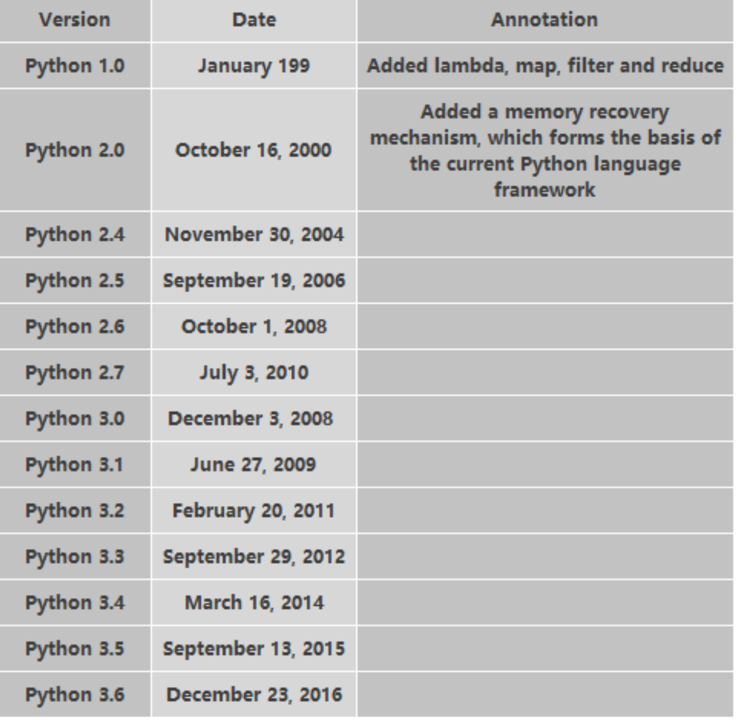

The other kind of language processor is called interpreter. 
Instead of producing an executable target program as a translation, 
an interpreter directly execute the operations specified by the source program. 
Figure 2 shows the principle of an interpreter. 


The advantage of a target program produced by a compiler over an interpreter at mapping inputs into outputs is its speed, 
while an interpreter can usually give better error diagnostics than a compiler, because it executes the program statement by statement.

### 2.2 The development of compilers
Complex and ubiquitous software architectures underpin the global economy [13]. Compilers and high-level languages are the cornerstones of such software. In addition, powerful and elegant compilation technology also has an extremely important value in hardware synthesis and other fields. Compilers and high-level languages are central to the information age as semiconductor technology [24].

By far, the most striking achievement in the compiler field is the widespread use of high-level languages [16]. From banking and enterprise management software to high-performance computing and various World Wide Web (Web) applications, the vast majority of today's software is written in high-level languages and compiled statically or dynamically [17].

The first practical computer compiler, written for the A-0 system in 1952 by American female computer scientist Grace Murray Hopper on UNIVAC I, compiled programs into machine code [38]. However, its function was much closer to what we now know as a linker or loader. The compiler loads punched cards that carry programs written in human languages into the computer. The computer spits out another set of cards containing machine code. The second set of cards is loaded into the computer, and the computer can execute the new program. In response to the shortcomings of assembly language, Fortran, led in 1957 by John Warner Backus, an American computer scientist working for IBM, was the first fully functional high-level language compiler implemented [33].

In the 1950s, the field of the compiler was beginning, and scientists' research focus was limited to the conversion from high-level languages to machine code and the time and space requirements of optimizing programs [51]. Since then, much new knowledge has emerged in program analysis and transformation, code automation, and runtime services. At the same time, compilation algorithms are also used to facilitate software and hardware development, improve application performance, detect or avoid software defects and malware. At the same time, the field of compilation is increasingly intersecting with other areas such as computer architecture.

Object-oriented and data abstraction languages were first introduced in the late 1960s and early 1970s, and it was realized that these concepts could greatly improve programmer productivity. Computer architects and compiler writers first began to consider the static and dynamic optimizations invented in the field of parallelism compilers, seeing parallelism as a promising solution to the problem of computers not being fast enough. Instruct level parallelism was introduced in Seymour Cray's CDC 6600 and CDC 7600 and IBM System/360 Model 91. The compiler front end greatly benefited from developing systematic theories based on the automata theory of lexical, syntactic analysis techniques [60].

In the 1970s, CRAY-1 became the world's first commercially successful supercomputer [39], and the success of the CRAY machine was largely due to the introduction of the vector register. Like scalar registers, vector registers allow programs to perform many small data vectors [69]. Cray Research has also developed a very aggressive vectorization compiler. It is similar in many ways to the earlier TI compilers, but the Cray compiler has some features that make it very interesting. One of the most important features is that the ability to provide compiler feedback to the programmer. Many projects have focused on the automatic generation of other parts of the compiler, including code generation. In short, the Cray programmers finally achieved the three goals of performance, productivity, and portability.

In the early stage of developing a high-level language compiler, the technology is not mature enough, and the generated target code is large, the execution efficiency is low. These problems affect the promotion and application of high-level language. Cocke(1976) made an in-depth study of compiler code generation technology and put forward a series of optimization methods[40]. For example, the program integration, loop conversion, the elimination of common subexpressions, code movement, register positioning, storage unit reuse, so that the quality of the compiler has been greatly improved. The development of compilation technology reached a new stage [62].

In the 1990s, the messaging library was replaced by the Messaging Interface (MPI), and all those vendor-specific parallelization instructions were replaced by OpenMP. More scalable parallel systems emerged, such as Thinking Machines CM-5 and others with thousands of commercial microprocessors. SIMD instruction sets for single-chip microprocessors are on the market, and there is growing interest in redirectable compilers with SIMD support [13], such as SSE and SSE2 from Intel. 

Shortly after 2000, multi-core microprocessors began to be widely offered by many vendors. Compilers include applications for more complex algorithms that are used to infer or simplify information in programs. Compilers are increasingly a part of window-based interactive development environments. They include editors, linkers, debuggers, and project managers.

Compared to earlier compiler implementations, today's compilation algorithms are significantly more complex. While early compilers used simple and intuitive techniques for lexing programs, today's lexing techniques are based on formal languages and automata theory, making the compiler front end more systematic [19]. Similarly, the reconfigurable compiler work that used simple and intuitive techniques for dependency analysis and loop transformation today uses powerful algorithms based on integer linear programming.

Despite all the advances in compiler technology, some people still see compilers as more of a problem than a solution. They want the predictability that comes from the compiler, rather than the advanced analysis and code transcoding that optimizes the compiler in the background.

### 2.3 The development of Interpreters
A compiled language means that after we write a program, we translate the code into a binary file and execute the program by executing the binary file. Interpreted languages, on the other hand, do not convert binaries but compile them when needed. The interpreter includes a compilation process, but this compilation process does not generate object code. A Python interpreter consists of a compiler that converts source code into bytecode, which is then executed line by line through the Python virtual machine and a virtual organization. When we write Python code, we get a text file with an a.py extension that contains Python code. To run the code, a Python interpreter is required to implement Python files. In 1989, Guido began writing a compiler for the Python language; In 1991, the first Python compiler was created. It is implemented in C and can call C library files. Python already had classes, functions, exception handling, core data types including tables and dictionaries, and a module-based extension system. Since then, Python has been updated, with the current version being Python 3.8 (Figure 3). In summary, Python 2.x is legacy; Python 3.x is the present and future of the language.


### 2.4 Interpreters & compilers for popular modern programming language
Here are principle of how modern programming language processors are realized. 
Some of them belongs to interpreter, like Python, 
Some of them belongs to compiler, like C/C++, 
while there is also some kinds of language whose execution go through both a stage of compile and a stage of interpret, like Java. 

#### 2.4.1 Python interpreters
There are some popular python interpreters: CPython, Jython, IronPython, and Pypy. 
1. CPython is a reference implementation written in C and is the most widely used Python interpreter. 
2. IPython is an interactive interpreter based on CPython. In other words, IPython is only enhanced in terms of interaction, but executing Python code is the same as that of CPython. 
3. Jython and IronPython are alternative implementations of Python interpreters targeting the Java virtual machine and The.net frameworks, but they typically do not improve performance [16].
4. Pypy is another Python interpreter, and Pypy is the most outstanding effort to develop an alternative interpreter to improve Python's execution speed. Its goal is the speed of execution. Pypy uses JIT technology to dynamically compile Python code (note that it is not interpreted), so it can significantly improve the execution speed of Python code [10].

#### 2.4.2 C/C++ compilers
Visual C++ is the most popular compiler on the Windows platform which integrates well with VS and has good compilation efficiency and compiled code efficiency. GCC/G+ is the preferred option on Linux/ UNIX platforms and supports N component platforms.

#### 2.4.3 Java Virtual Machine
For Java, the compiler compiles the Java source files (.java files) into bytecode files (.class files), which are binary. This bytecode is the "machine language" of the JVM (a virtual machine capable of running Java bytecode). Javac.exe can be thought of simply as a Java compiler. The Java interpreter is part of the JVM. The Java interpreter is used to interpret programs that have been compiled by executing the Java compiler. Java.exe can be thought of simply as a Java interpreter. The JVM interprets the execution of a bytecode file as the JVM manipulates the Java interpreter to interpret the execution of a bytecode file. The JVM masks information specific to a specific operating system, allowing Java programs to run unchanged on multiple platforms by generating only the object code (bytecode) that runs on the Java Virtual Machine.

## 3 Project Description
If we look into the working process of interpreters or compilers in detail, 
we could find that they operate as a sequence of stages, 
each of which transform one representation of the original program into another. 
A typical decomposition is shown in Figure 4. 

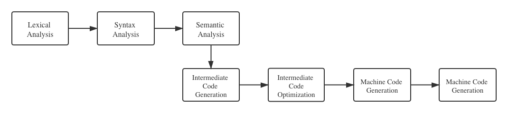

In this flow chart here are seven steps in total. 
The three steps above, namely lexical analysis, syntax analysis, and semantic analysis, 
are usually regarded as the front end, which is responsible for analyse the source program by breaking it up into constituent pieces, 
create an abstract syntax tree to represent it, and report the problem properly when bugs are detected. 
To develop an interpreter we only need to implement these three parts. 
The four steps below, namely intermediate code generation, intermediate code generation, machine code generation, and machine code optimization, 
are usually regarded as the back end, which is responsible for synthesis the target program, using the information provided by the front end. 
To develop a compiler, the back end is also necessary. 

The structure of our final project is shown in Figure 5, in which the responsibility of different members are labeled accordingly. 


## 4 Work Division
Since there are three members in our group, we firstly divided the work as following: 

### 4.1 Han Sanyue's work
Han Sanyue developed the lexical analyzer, syntax analyzer, semantic analyzer in the front end. 
He integrated these part so that the interpreter could work in two different modes. 
The feature realized including arithmetic operators, logical operators, relational operators for evaluation of expressions, 
selection statements and iteration statements for control the flow of execution, 
four basic data types for representation of different kinds of data, 
and a few built-in functions that provide scientific calculation functionality just like MATLAB. 

### 4.2 Zou Yang's work
The four stages in the back end is assigned to Zou Yang at first. 
In our early plan the back end combined with the achievements from front end could form a compiler. 
Zou Yang realized some very basic function for the back end, namely some arithmetic operation. 
However, with the progress of the project, it seems that this part is too complicated to continue, 
the reason will be explained in Zou Yang's individual part. 
So, after a discussion our group reassigned some work involves the error reporting in front end to Zou Yang, 
He finished this part perfectly, so the interpreter could report different kinds of error in the three stages, 
print not only the type of error but also the position of the code that cause the error. 

### 4.3 Hao Tingting's work
Hao Tingting undertakes the work of testing, including both testing on individual modules and testing the total product,
to ensure that the interpreter or compiler will not only produce right results for correct code, but also report proper error for buggy codes.
She implemented a framework called unittest in order to realize auto-test function. 
And she also developed some scripts that can produced some random scripts to test the features that the other group members realized. 
When she finds that the behavior of our software is not the same as what was defined in the documentation, 
she will report the problem to the member who develop that part. 
What's more, sometime she will come up with some ideas and implement them to help other group members fixing the bugs. 

## 4 Individual Job Description
### 4.1 Han Sanyue's Individual Part
#### 4.1.1 Introduction
As mentioned earlier, my main work involves with realize the three phrases in front end, 
namely lexical analysis, syntax analysis, and semantic analysis, in other words the modules an interpreter needed. 
To interpret a program, the lexical analyzer firstly convert the input code from a string to a list of tokens. 
Then the syntax analyzer will build an abstract syntax tree to represent the structure of the program. 
Finally, the semantic analyzer will visit the syntax tree recursively to performing the corresponding operations. 
Integrating these modules we will get an interpreter. 
In the following subsections, I will explain the input, the output, the functionality, algorithms and data structures applied, 
as well as the code design of these modules in details firstly, and then summary the achievements. 

#### 4.1.2 Lexical Analysis
##### 4.1.2.1 Description
The lexical analyzer is responsible for the conversion from a sequence of character to a list of tokens. 
The source code written in the script, is essentially some text that is made up of a sequence of characters. 
The character could be encoded using ASCII, or some other encoding method such as unicode. 
In order to simplify complexity, let's firstly assume that the input code are always encoded using ASCII, 
so there are no more than 128 kinds of different characters that may exist in our input text stream. 
Just like reading a book, although the content are printed character by character, 
people read them by recognize the characters as groups called word. 
For a programming language processor, 
the first thing it does on the input character sequence is to split the characters into similar groups that is called tokens. 
The tokens have different types, some tokens belong to the keyword type, such as "if", "else", "while", "for" which are very common to see in lots of languages, 
some tokens belong to identifier type, that is the case when you declare to define a variable whose name is up to you, 
some tokens belong to literal types, it occurs when you write some constant numbers or strings in the code, 
and some tokens belong to operator types, such as the plus symbol "+", assignment symbol "=", etc. 
Let's see an example of analyze a code fragment, the expression "age >= 35", in figure x. 

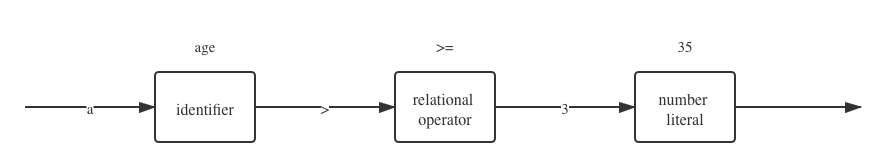

##### 4.1.2.2 Method
To recognize the symbol, there are two different methods. 
One is to implement the finite state machine, the algorithm is to transform between states depend on every input characters, 
and the finial stopping state indicate the token types. Another method is to use regular repression which is adopted in this part. 
There are two advantages of regular expression over finite state machine on this task. 
The first one is that finite state machine is difficult to implement, 
because the data structure of the finite state machine and the transformation condition between different stages need to be coded in detail very carefully. 
however, if regular expression is applied, for Python in which we develop our project, 
it has a very power built-in module called re that is capable of compiler a pattern you designed and automatically test if a pattern matches with a string. 
The second one is that regular expression is the basis of Extended Backus-Naur Form, 
which will be explained in the syntax analysis part. 

In the following some examples of the patterns used for recognize tokens are introduced. 
The pattern for recognizing the keyword type looks like this:
```markdown
"break|case|catch|continue|elseif|else|end|for|function|"
```
It means that if the words split by a "|" is match with the character stream, a keyword is recognized. 
The regular expression for identifier looks like this:
```markdown
"[a-zA-Z]+[a-zA-Z0-9_]*"
```
This means that a valid identifier in MATLAB should start with a letter, and could be followed by a number of letter, digit, or underline. 
You may wonder there is a problem: all the keywords could be matched by the pattern of identifier, 
so why won't the lexical analyzer be confused about whether a token should belong to identifier type or keyword type? 
The answer is easy: when recognizing the next token in the input string, we use all the pattern defined in a specific order, 
if any one of them matches the string, then the token is recognized. Therefore, to make the lexical analyzer work correctly, 
it is necessary to not only write the correct regular expressions, but also make sure the order of the patterns are correct. 
For every situation when one kind of token is the prefix of another token, 
the shorter token should appear later that the longer token in order to avoid mistakes. 
For example, the operator ">" should appear later than ">=", and "=" should appear later than "==", etc. 

##### 4.1.2.3 Token Class
A class is defined for the tokens. There are four attributes in this class:
- type  
  indicating what kind of token it is, that is distinguished by different regular expressions.
- text
  text is the string matched in the input stream. this information will always be needed in the following stages
- col
  the column number where this token appears in the source code, which is useful in error reporting
- row
  the row number where this token appears in the source code, which is useful in error reporting

##### 4.1.2.4 Algorithm
The core of the lexical analyzer is a function that read from the input string, 
recognize tokens and remove used characters until nothing left in the input sequence. 
If at any time the beginning of the input sequence could not be matched by any pattern, 
the analyzer will raise error. The flow chart representing this algorithm is shown in Figure x. 

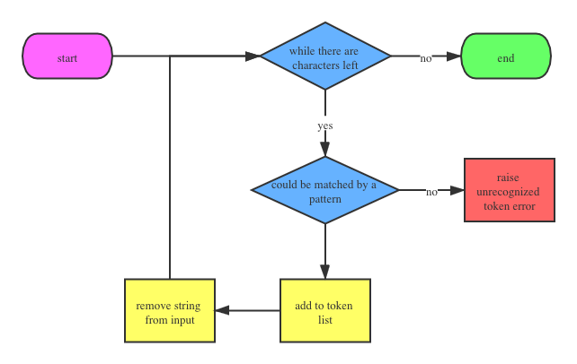

##### 4.1.2.5 Example
Let's see an example of the lexical analysis. Here is a very simple script. 
```markdown
a = 0;
while a < 10
    a
    a = a + 1;
end
```
We can print its lexical analysis result, which is a list of tokens. 
```markdown
row =   1        col =   0        type = IDENTIFIER        text = 'a'
row =   1        col =   2        type = ASS               text = '='
row =   1        col =   4        type = NUMBER_LIT        text = '0'
row =   1        col =   5        type = EO_STMT           text = ';'
row =   1        col =   6        type = EO_STMT           text = '\n'
row =   2        col =   0        type = KEYWORD           text = 'while'
row =   2        col =   6        type = IDENTIFIER        text = 'a'
row =   2        col =   8        type = REL               text = '<'
row =   2        col =  10        type = NUMBER_LIT        text = '10'
row =   2        col =  12        type = EO_STMT           text = '\n'
row =   3        col =   4        type = IDENTIFIER        text = 'a'
row =   3        col =   5        type = EO_STMT           text = '\n'
row =   4        col =   4        type = IDENTIFIER        text = 'a'
row =   4        col =   6        type = ASS               text = '='
row =   4        col =   8        type = IDENTIFIER        text = 'a'
row =   4        col =  10        type = ADD               text = '+'
row =   4        col =  12        type = NUMBER_LIT        text = '1'
row =   4        col =  13        type = EO_STMT           text = ';'
row =   4        col =  14        type = EO_STMT           text = '\n'
row =   5        col =   0        type = KEYWORD           text = 'end'
row =   5        col =   3        type = EO_STMT           text = '\n'
```
It is shown that for every token, the text, the type, the col number, and the row number and all recorded.

#### 4.1.3 Syntax Analysis
#### 4.1.4 Semantic Analysis
#### 4.1.5 Conclusion
### 4.2 Zou Yang's Individual Part

#### 4.2.1 Preparation

At the beginning of the project, my division of work was mainly on the back end of the compiler, using the abstract syntax tree generated on the front end to generate the corresponding assembly code, and then planning to use “GCC” to link the assembly code to generate an executable file to verify that the assembly code could be executed correctly. In the early stages of the project, the main learning resource I've been referring to is the “PlayWithCompiler” project on github (https://github.com/RichardGong/PlayWithCompiler).

#### 4.2.2 Compiler back-end section

Although my division of work is for the back-end part, I have been learning the front-end part for some time, as I need to understand the composition and structure of the abstract syntax tree in order to make better use of it when generating assembly code. As stated in our proposal form, the extent of completion of the back-end is dependent on the progress of the completion of the front-end, in other words, on the progress of the abstract syntax tree produced by the front-end.

##### 4.2.2.1 Back-end code logic (code can be seen in the directory “IV_assgen”)

In the middle and later periods of our project, the abstract syntax tree took shape, and the basic functionality, i.e. supporting for basic variable assignment and simple operations, was initially completed in the process of lexical analysis to syntactic analysis. Therefore, I started writing code for generation of assembly code based on the abstract syntax tree produced by the front-end, which is included in the file called “asmgen.py”. 

For "asmgen.py", my design idea is to firstly import the abstract syntax tree generated by the front-end part, which in our project is actually a node called “ASTNode”, and traversing the children of this node achieves the purpose of traversing the whole tree. Then the specific type of the node in the syntax tree should be imported, e.g. if the content of a node is "+", then the specific type is "BOP_EXP", i.e. binary operation expression. I created a class called "Asmgen". Encapsulating the code in a class makes it easier to call it later when integrating the four parts, namely lexical analysis, syntactic analysis, semantic analysis and code generation, which can be seen in "script_execute.py”.

In the class "Asmgen", in order to make it extensible, i.e. to make it easy to modify the code in this class to generate assembly code for new operations as the abstract syntax tree supports new operations, I have adopted a top-down logic, i.e. breaking down the big problem into smaller problems. The logic for generating assembly code is as follows: the assembly code is inherently formatted with a start and end segment, which can be added directly to the final string, and then the entire syntax tree is traversed, a process that is implemented by another function which plays a leading role. A new function was used to traverse the syntax tree, in other words to traverse each node in the tree. The traversal of an individual node was done by setting up a new function, which exemplifies the idea of programming to decompose a large problem into sub-problems step by step. 

##### 4.2.2.2 Back-end code conclusion

Unfortunately, after initially writing this part of the code, which only supports variable assignment and addition and subtraction operations, the executable file I generated by using the GCC link command "gcc asm.s -o asm" only worked on Mac, but failed on Windows, which is my development environment. The error was shown in Figure 0.

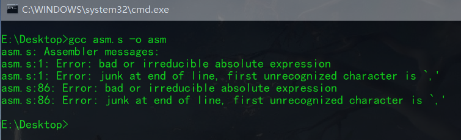

In the process of looking for a solution, I found the back-end platform compatibility problem difficult to solve. 
One reason is that the person responsible for the back end needs to understand the results provided by the front end, 
before starting his own part, and if the front end go through a refactor that change something, 
such as the structure of the abstract syntax tree, the back end also need to be adjusted accordingly. 
Another reason is that using interpreter the script code could run on any platform 
as long as the language in which the interpreter is written could run on that platform, 
for example python has different release versions on Windows, macOS, and Linux, 
but for compiler the target program is directly executed by the CPU, 
so the back end involves dealing with different instruction set on different processor. 
What's more, to link assembly code, I need to call the libraries underlying various operating systems. 
With less than a month to submit, there was not enough time to solve this problem. 
Therefore, after discussing with my group members and mentor, my focus shifted from the back-end to the front-end. 
The final output of our project also changed from a compiler to an interpreter.

#### 4.2.3 Error handling in the front-end

My part changed to deal with the exception throwing parts of lexical analysis, syntax analysis and semantic analysis. Specifically, we cannot assume that the user is an idealized user who cannot make mistakes. The user could inevitably write some bugs when using the interpreter to write code, which requires the interpreter to alert the user to which line, which column and what type of error has occurred.

##### 4.2.3.1 Construction of the exception class (code can be seen in the folder "exceptions")

Python is a language that allows object-oriented programming, and the inheritance feature is very useful for the implementation of exception classes. I created two parent classes containing a certain amount of common features of the exception type. As an example, in lexical analysis there are two error types "InvalidCharacterError" and "StringTerminationError", and handling statements of MATLAB for these two exceptions are shown in Figure 1 and Figure 2. Because the redundant information above and below (the red boxed parts in Figure 1) was not essentially part of the error handling section, I ignored them here. It can be seen that the common features of both error types are that they both contain "Error: File:", followed by the path to the file, then the line and column numbers (I have marked the common features as written in Figure 2). 

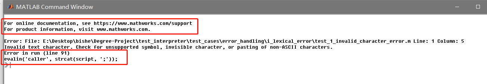

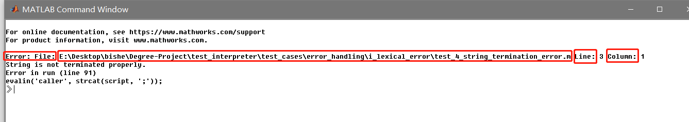

###### 4.2.3.1.1 Construction of the parent class "InterpretException" and the inheritance process

Based on the features stated above, I have summarized the first parent class, "InterpretException", which inherits from the generic python exception class "Exception". This allows us to redefine the "__str__" function to directly output the error statement we want when an exception is thrown, by setting the return value of the "__str__" function according to the format of the error statement ("InterpretException" is shown in Figure 3).

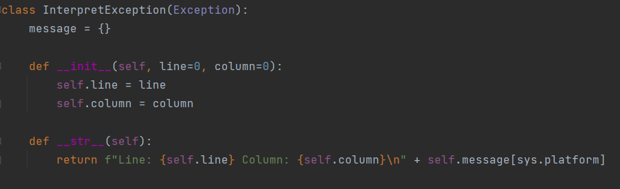

There was a hiccup here, in the process of development and continuous testing, I found that the format of the real MATLAB error statements on windows platform and Mac platform are not exactly the same. For example, if you run the same file "test_1_invalid_character_error.m" in Mac, the error message is shown in Figure 4, where you can see that the Mac platform will use a line break for a portion of an excessively long error message. Since the Python language has many easy-to-use modules, my solution was to import the module "sys", which provides a set of variables and functions for the Python runtime environment, and "sys.platform" can get the platform of the current runtime environment. [1] Simply use the Python dictionary type in the subclass to automatically select a different format for the error statement depending on the platform (the key values are "darwin" for Mac and "win32" for Windows).

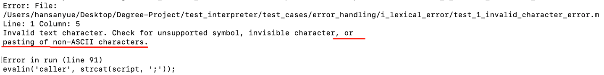

After creating the parent class, the construction of the child class could be made easily by the definition of the class variable "message" in the parent class. Since the common features for lexical and syntactic analysis are contained in the "InterpretException" class, the only thing that needs to be changed for these two phases is the class variable "message"(The implementation of these exception classes can be seen in "lexical_exception.py" and "syntactic_exceptions.py"). For example, for the "EndMissingError" exception class in the syntactic analysis, it is very simple to implement, just inherit from "InterpretException" and redefine the class variable "message", as shown in Figure 5.

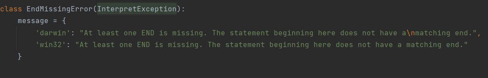

###### 4.2.3.1.2 Construction of the parent class "InterpretException2" and the inheritance process

For the exception in the semantic analysis phase, its error statements are very different from the first two phases, so I created another parent class "InterpretException2". As an example, for the "UnaryOperatorForStrError" exception class in the semantic analysis, the result of MATLAB's error reporting is shown in Figure 6. Comparing this with Figure 1 or Figure 2, you can see that the error statement, which means "message", is no longer static, it needs to be adjusted according to the operator where the MATLAB code is in error. Because the type of error I was testing for is an error where the operator cannot use a minus sign, the error reporting statement in Figure 6 appears with a minus sign '-'. The second point is that it no longer contains the file path. The third point is that it only gives the line number where the error statement is located, not the column number, which makes sense as this type of error means that the whole statement is illogical. Finally, MATLAB outputs the entire error statement. By summarising the above four points, the "InterpretException2" exception class is implemented as shown in Figure 7.

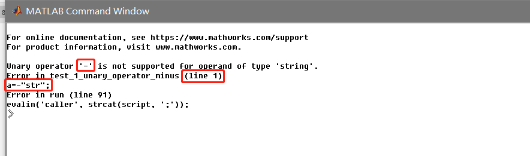

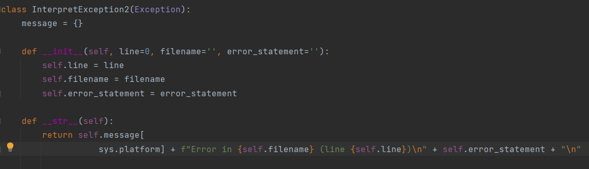

For the subclasses, since "message" needs to be adapted to different situations, I have set up a function to receive parameters to change the minus '-' sign in "message" as described above, one of the implementations is shown in Figure 8. The "unary_operator" is the variable that I have stated needs to receive the argument.

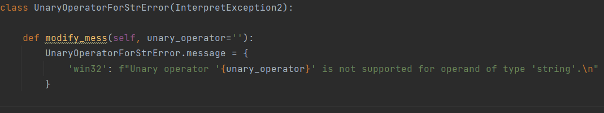

Of course, in the semantic analysis phase, there are also situations that the class variable "message" does not need to be changed, such as the exception subclass "ErrorUsingMultiply" (as shown in Figure 9). In fact it is almost identical to the exception subclasses of the first two stages, except that it inherits from a different parent class.

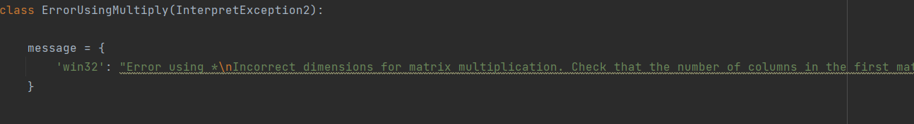

##### 4.2.3.2 Construction of sample error files (files can be found in the folder "error_handling")

The process of constructing sample bugs is essentially to list as many errors or bugs as possible that occur when users write MATLAB code.

During the lexical analysis phase, the user may incorrectly enter special characters such as '#' or forget to add an end flag when defining a string or character vector, then the program should throw an exception at this stage. Therefore, I constructed the statements such as "a = #" to check that the program throws the correct exception.

The exceptions that may arise during the syntactic analysis phase I summarize as the following three:

1-The end character "end" is missing. In MATLAB, we need to add "end" at the end of the statement blocks, such as if, while, for, otherwise we would get an error.

2-Incomplete statements, e.g. forgetting to add right brackets.

3-Invalid expressions, such as two separate statements written on one line without a separator, i.e. a semicolon, or square brackets on the left and round brackets on the right, which is a typical invalid expression.

The semantic analysis phase focuses on performing some of the advanced mathematical operations that are characteristic of the MATLAB programming language, such as multiplication and division of matrices and concatenation operations, or comparison operations on strings. For matrix operations, if the dimensions of two matrices do not conform to the rules, then the operation cannot be performed. For string comparisons, strings can only be compared with each other and not with other types such as integers, otherwise an exception is thrown.

In conclusion, these examples actually need to be refined, as there is a limit to the power of one person to exhaust all possibilities, so there may be exception types that have not been included that still need to be added.

##### 4.2.3.3 Invocation of exception classes in three phases (The process is contained in the code of the three phases)

###### 4.2.3.3.1 Lexical analysis phase ("lexer.py")

The work at this stage is mainly to cut the string of the MATLAB file into individual "tokens", and how the exception class is called is shown in Figure 10.

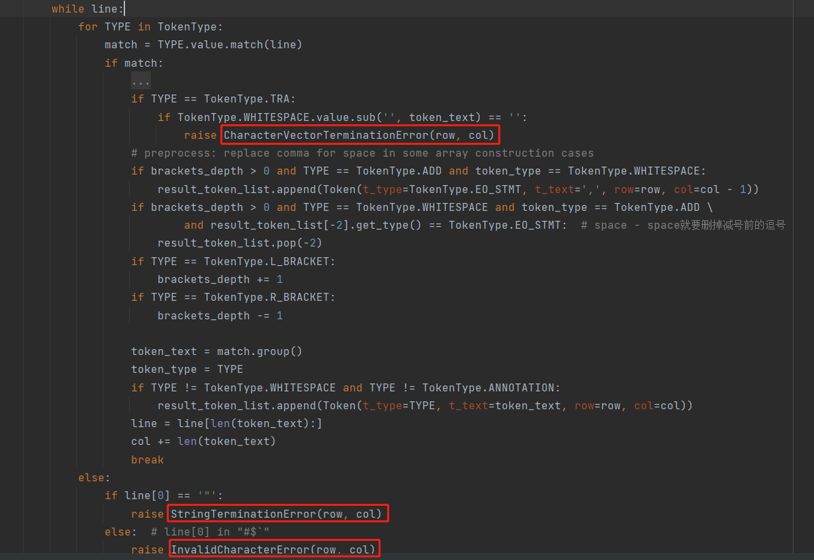

For "CharacterVectorTerminationError", when slicing each line, if the current token is a single quote, which means that the character vector is currently in use, then determine if there is a token or space before it in the current line, and if so, then there is clearly an exception here, i.e. the character vector is not properly terminated.

After determining the type of the current token, it is common sense that if there is no error, the loop will break and continue to determine the next token on the current line. However, if after iterating through all the token types, no matching type is found, then the loop will not be jumped out by break, which means that the for loop ends normally, this situation is obviously an exception, so the for else statement block in python is used, which means that the statement in else can only be executed when the for loop ends normally. I thought of two scenarios for the exceptions that occur here. One is the case of a double quote at the beginning of a sentence, which means that there is only one single double quote on the current line, because the pair of double quotes could be recognized by the regular expression in the token type, i.e. "STRING_LIT". Therefore, the single double quote case clearly raises an exception, i.e. the string does not end properly. Another case is when the user enters an invalid character, such as "#$`", which would raise an exception for an invalid text character.

###### 4.2.3.3.2 Syntactic phase (parser.py)

Syntactic analysis identifies the syntactic structure of a program on the basis of lexical analysis, which is a tree-like structure, also known as an abstract syntax tree. Once at this stage, exceptions about characters have been filtered out and the types of exceptions that can be detected at this stage are syntax type errors.

The first is the invalid expression exception, which is subdivided into three types because of the variety of expressions. 

1) The first is the absence of a separator, such as two separate statements without a separator, or a block of statements such as if without a separator, will throw an exception, as shown in Figure 11, which determines whether the current statement is correctly separated from subsequent statements by determining whether the type of the current node is "EO_STMT", i.e. a separator.

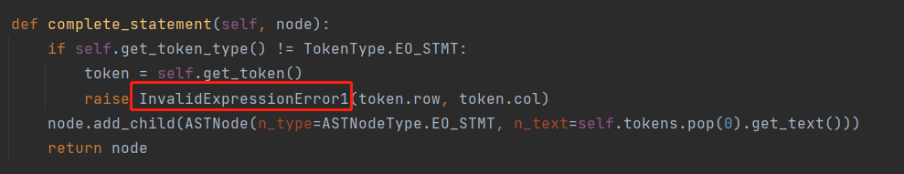

2)The second is when parsing the primary expression and another operand is found to be missing, then obviously an exception should be raised for the missing character, called as shown in Figure 12, by determining whether the current node belongs to the primary cases, and if not, then determine whether the statement is finished, and if so, throwing that exception.

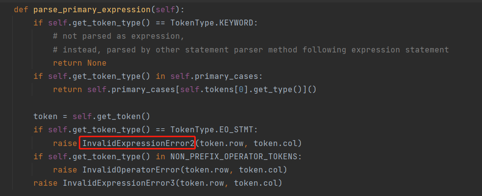

3)The third is when parentheses appear in the current statement, then the program would assume that a function is currently being called or a variable is being indexed. However, if the other half of the brackets are missing or if there are square brackets on the left and round brackets on the right, an exception will be thrown. This exception occurs in three places, the first being when parsing the primary expression (Figure 13). Since it is not convenient to set up an if statement to determine this here, I have chosen that after determining other types of exceptions, the remaining case must be this type of exception; the second is when parsing an expression containing parentheses (Figure 14), throwing an exception of that type if the right-hand side never finds the right half of the parentheses during traversal; the third is parsing an expression containing square brackets (Figure 15), essentially the same principle as the second call.

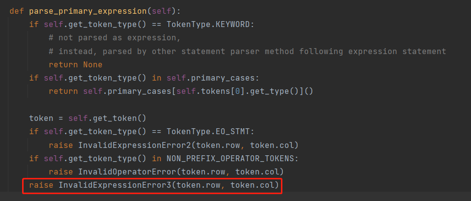

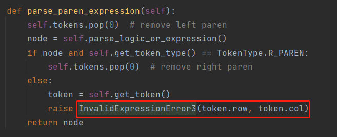

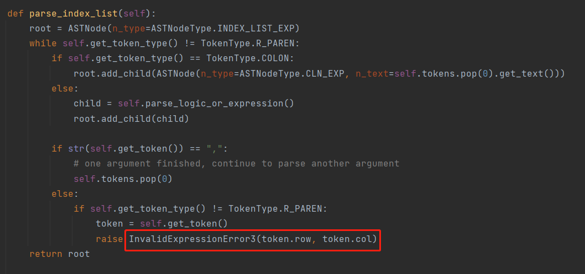

Next is the "end" terminator missing exception, with a total of 4 calls. The first, second and third are all cases where "end" is not detected when parsing a selection statement (Figure 16), the difference being that in the first case the MATLAB code only writes if/switch, in the second case it writes additional elseif/case branch, and in the third case it writes an else/otherwise branch, all three of which should throw an exception if "end" is not detected. The fourth case is where the "end" is not detected when parsing the loop statement (Figure 17), and the principle of the call is exactly the same as before.


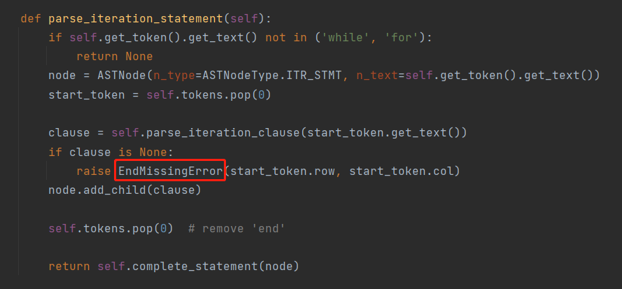

Finally, there is the exception for incomplete statements encountered when parsing square bracketed expressions (Figure 18). With the judgement that the function encountered a node with the content None without finding the terminator, so clearly the statement is not complete and the exception should be thrown. So far, the only sample error I can think of is the case of parsing square bracketed expressions, and I think there are still some cases that I have not found.

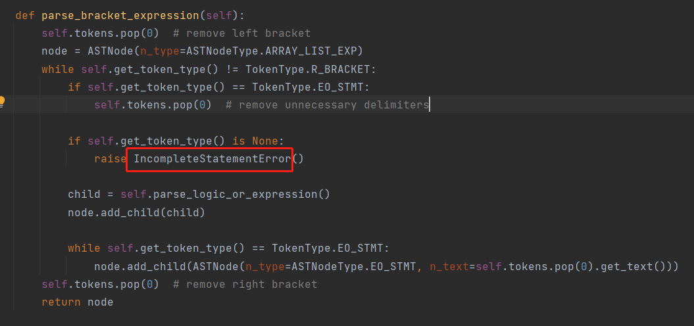

###### 4.2.3.3.3 Semantic analysis phase (operations.py, interpreter.py, utils.py)

The first is that it does not apply to unary operations on String, such as "+'str'", which obviously has no positive or negative properties and for which the inverse '~' operation cannot be performed, as shown in Figure 19, which determines whether an exception is thrown by determining whether the operand is String type.

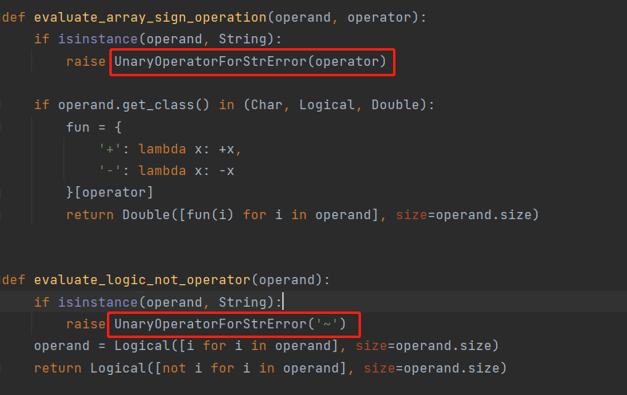

The second one is not applicable to binary operations concerning String, such as multiplication '*' and left division and right division operations in matrices (Fig. 20, Fig. 21). Whenever at least one of the two operations of the binary operation is String type, the corresponding exception is thrown. There are also many binary operations such as subtraction '-', dot product '. *', etc. To save space, these can be found in the 'operations.py' file, and the principle of calling exception classes is the same.

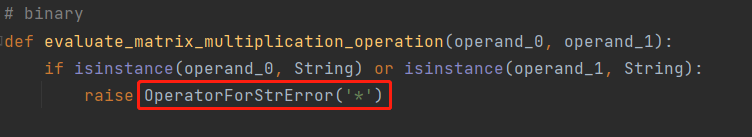

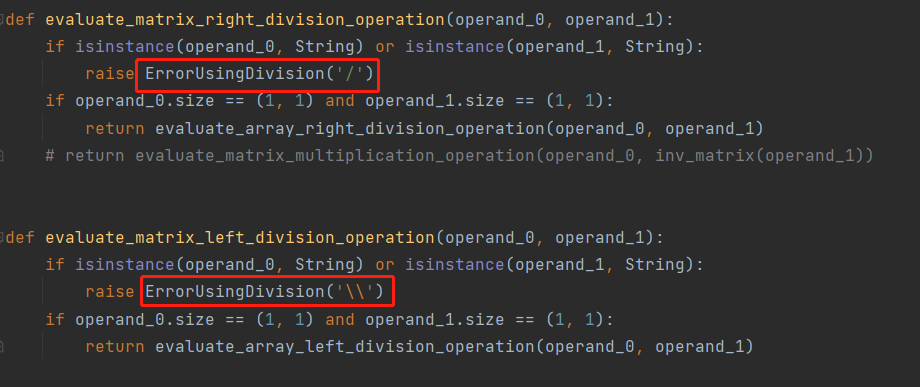

The third one is that the multiplication operation of two matrices throws an exception because the matrix dimension does not match the rules of the operation (Figure 22)

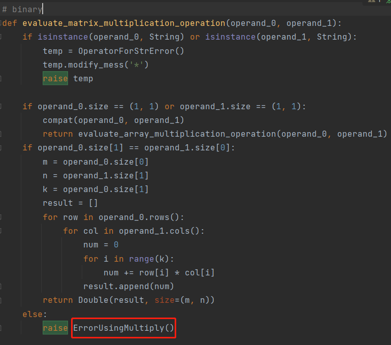

The fourth is a comparison operation concerning String (Figure 23). When a comparison operation is encountered, the operands on both sides are detected and an exception is thrown if one side is not String.

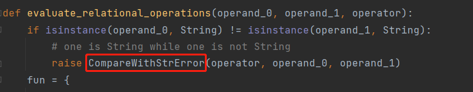

The fifth is the type of exception that is thrown when an undefined function or variable is encountered (Figure 24). By detecting whether the identifier to be retrieved is in the list of variables or keywords already defined, and throwing an exception if it is not.

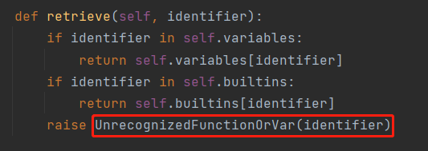

The last one concerns the concatenation operation of matrices (Figure 25), which is divided into two types, one for horizontal concatenation and one for vertical concatenation. When the two matrices need to be concatenated in different dimensions, an exception is thrown for dimensional inconsistency.

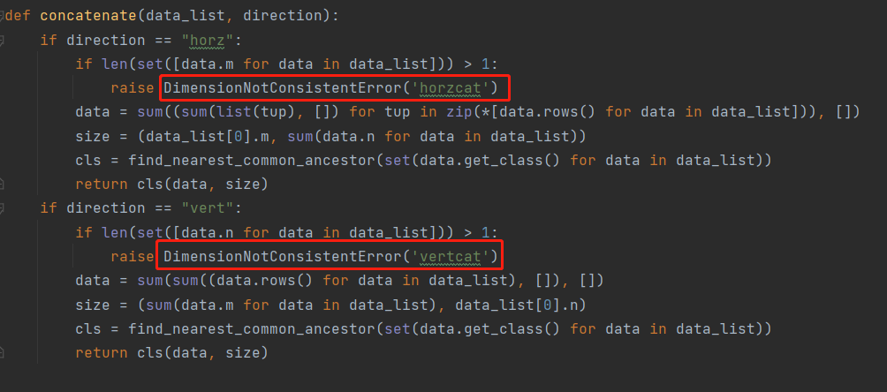

##### 4.2.3.4 Test work for error handling (test_error_handling.py)

The testing process of the project is implemented with the help of Python's unit testing function. In the unit test file, the program will first run the MATLAB command (The path to the matlab program needs to be added to the environment variable) “matlab -nosplash -nodesktop -nojvm -batch \"run('{path}')\" -logfile {temp}” through the terminal. It can run the MATLAB scripts I set up by not launching the MATLAB GUI. The output is then saved to a txt file (e.g. for the lexical analysis file "test_1_invalid_character_error.m", the MATLAB output is shown in Figure 26). It will then run our python project program to save the output to another txt file (Figure 27). The MATLAB output contains unnecessary content, i.e. the parts marked in blue in Figure 26, which can be filtered out using regular expressions. Finally, we can conclude whether the output of the MATLAB and python programs are equal, for example by testing the lexical analysis run as shown in Figure 28.

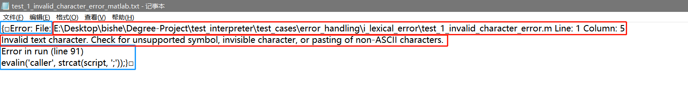

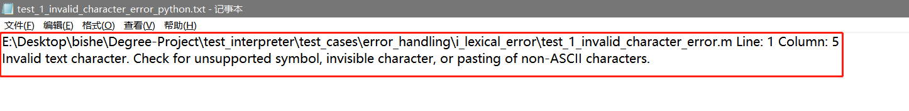

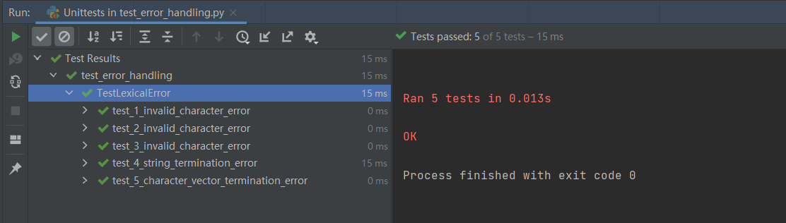

##### 4.2.3.5 Error Handling Conclusion

For the error handling section, there still need to add more exception types, as there is a limit to what one person or group can do, and inevitably there will be cases of omissions.

### 4.3 Hao Tingting's Individual Part

## 5 Overall Discussion and Conclusions. 
Comparing to official matlab software
- limitation on functionalities
  - only have four most basic data types
  - only a few built-in functions
  - only support two-dimensional array, not higher
- limitation on error handling
  - not robust enough
- limitation on performance
  - use figure to demonstrate
    

Since MATLAB is a business software which is developed by professional engineers for years,
it is impossible to produce a comparable product in a Degree Project. 
However, ...
Therefore, ...

## 6 Suggestions for possible future work.
- unsolved bugs
  - signed zero problem
- planed upgrade features
  - complex number
  - function definition syntax
  - object-oriented programming
  - other syntax and command
- optimization direction
  - speed
  - robustness
- research areas
  - compiler, machine code part

## References

[1]https://docs.python.org/3/library/sys.html