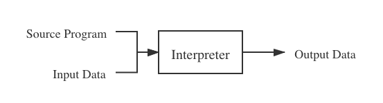
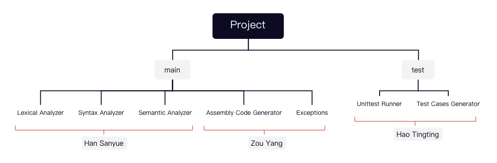

# An alternative to MATLAB - implement MATLAB in Python

## 0 Abstract
[MATLAB](https://en.wikipedia.org/wiki/MATLAB) as an abbreviation of "matrix laboratory", 
stands for the programming languages as well as its software implementation
who is officially defined and released by the [MathWorks Corporation](https://www.mathworks.com/). 
The purpose of this project is to implement a subset of the MATLAB programming language using python, 
that is as similar as possible with the official software, specially MATLAB_R2021a, 
in terms of text outputs, from a normal user perspective. 
The aim of this project is to learn the technologies and tools in compiling, 
in order to understand the principles of interpreters and compilers from a language designer's view, 
and gain a deeper insight in the nature of programming languages. 
There are two main approaches used when developing this project. 
The first one is to read the explanation in the [official documentation](https://ww2.mathworks.cn/help/matlab/) in order to understand the designed behavior of different syntax, 
and the second one is to run some experimental code on the MATLAB software and then watch their results. 
In other words, like reverse engineering, some detailed features are simulated by inferring the internal design of the official software, 
and then finding some equivalent ways in python, when the documentation is not elaborate enough. 
The achievements of this project including the realization of most operators, a number of statements, different data types, 
as well as some matrix operations and built-in functions which are considered as an important advantage for MATLAB. 
As an important functionality for interpreters/compilers, 
our interpreter also implemented error handling to report different kinds of errors detected, when the input code have bugs. 
Additionally, we have an elaborate designed test module that is capable of testing all the features mentioned above, 
using manually designed test cases as well as auto-generated scripts, 
in order to demonstrate the correctness of the results produced by our product, or review bugs to repair. 

## 1 Introduction
Programming languages are notations for describing a flow of computational actions to people and to machines. 
However, according to their corresponding instructions sets, the CPUs only know how to execute machine code that is only consisted of 0s and 1s, 
not those higher level programming languages that we are familiar with, such as C, Java, or Python. 
Therefore, before a high level program can be run, it must be translated into a form in which it can be executed by a computer. 

There are two different ways to realize this. The first one is to use a compiler, 
that can read a program in one language and then translate it into an equivalent program in another language. 
If the target program is an executable machine-code program, it can then be called by the user to process inputs and produce outputs. 
Figure 1 shows how compilers work. 

The other kind of language processor is called interpreter. 
Instead of producing an executable target program as a translation, 
an interpreter directly execute the operations specified by the source program. 
Figure 2 shows the principle of an interpreter. 

The advantage of a target program produced by a compiler over an interpreter at mapping inputs into outputs is its speed, 
while an interpreter can usually give better error diagnostics than a compiler, because it executes the program statement by statement.

To design an interpreter or a compiler, 
you can not only provide another version of software implementation for an existing programming language, 
but also create a new programming language whose syntax is defined by yourself. 
The reason why we choose to develop a MATLAB implementation and mimic all of its functionalities and features is that 
for an existing programming languages you can find its [grammar rules file](https://github.com/antlr/grammars-v4/blob/master/matlab/matlab.g4) written in normal form, 
which could be very helpful for novices like us who has no experience in developing interpreters or compilers. 
This will be explained in detail by Han Sanyue. 
Moreover, for an existing programming language, it is convenient for us to carry out tests, 
since we could execute the test scripts using the existing interpreter or compiler, and compare the results produced by it with that of ours, 
which involves with Hao Tingting's job. 
Additionally, MATLAB is an interpreted languages that is easy to realize comparing to those compiled languages such as C/C++, 
the reason will be explained in Zou Yang's individual part. 

In this thesis, we will firstly review the development history of interpreters and compilers, 
and also introduce the interpreter or compilers of some famous modern programming languages like C/C++, Java, Python in Section 2. 
Then we will explain the structure of our project and the work division between group members in sections 3. 
After that in section 4, there are our individual works. 
Section 5 contains overall discussion and conclusion, in which we will compare our product with the official MATLAB software, 
and discuss the advantages and disadvantages. 
Last but not least, we have summary some possible work direction on our project that is not yet finished due to the limitation of time. 

## 2 Literature Review
- How modern interpreter/Compiler are designed

## 3 Work Division
### 3.1 The Structure of Interpreter/Compiler
If we look into the working process of interpreters or compilers in detail, 
we could find that they operate as a sequence of stages, 
each of which transform one representation of the original program into another. 
A typical decomposition is shown in Figure 3. 

In this flow chart here are seven steps in total. 
The three steps above, namely lexical analysis, syntax analysis, and semantic analysis, 
are usually regarded as the front end, which is responsible for analyse the source program by breaking it up into constituent pieces, 
create an **abstract syntax tree** to represent it, and report the problem properly when bugs are detected. 
To develop an interpreter we only need to implement these three parts. 
The four steps below, namely intermediate code generation, intermediate code generation, machine code generation, and machine code optimization, 
are usually regarded as the back end, which is responsible for synthesis the target program, using the information provided by the front end. 
To develop a compiler, the back end is also necessary. 

### 3.2 Work Division
Since there are three members in our group, we firstly divided the work as following: 
Han Sanyue is responsible for the three stages in the front end, so that an interpreter could work properly. 
Zou Yang is responsible for the four stages in the back, combining the achievements of front end to form a compiler. 
Hao Tingting undertakes the work of testing, including both testing on individual modules and testing the total product,
to ensure that the interpreter or compiler will not only produce right results for correct code, but also report proper error for buggy codes. 

However, with the progression of the project, we reached an agreement that the back end is more difficult than the front end. 
One reason is that the person responsible for the back end need to understand the results provided by the front end, 
before starting his own part, and if the front end go through a refactor that change something, 
such as the structure of the abstract syntax tree, the back end also need to be adjusted accordingly. 
Another reason is that using interpreter the script code could run on any platform 
as long as the language in which the interpreter is written could run on that platform, 
for example python has different release versions on Windows, macOS, and Linux, 
but for compiler the target program is directly executed by the CPU, 
so the back end involves dealing with different instruction set on different platform. 
Since it's seem to be difficult for Zou Yang to finish the back end perfectly, 
our group decided to reassign the job involving with reporting error in the interpreter part to Zou Yang. 

### 3.3 Structure of the project
The structure of our final project is shown in Figure 4, in which the responsibility of different members are labeled accordingly. 

## 4 Individual Job Description
### 4.1 Han Sanyue's Individual Part
### 4.2 Zou Yang's Individual Part
### 4.3 Hao Tingting's Individual Part

## 5 Overall Discussion and Conclusions. 
Comparing to official matlab software
- limitation on functionalities
  - only have four most basic data types
  - only a few built-in functions
  - only support two-dimensional array, not higher
- limitation on error handling
  - not robust enough
- limitation on performance
  - use figure to demonstrate
    
Since MATLAB is a business software which is developed by professional engineers for years,
it is impossible to produce a comparable product in a Degree Project. 
However, ...
Therefore, ...

## 6 Suggestions for possible future work.
- unsolved bugs
  - signed zero problem
- planed upgrade features
  - complex number
  - function definition syntax
  - object-oriented programming
  - other syntax and command
- optimization direction
  - speed
  - robustness
- research areas
  - compiler, machine code part

## References
